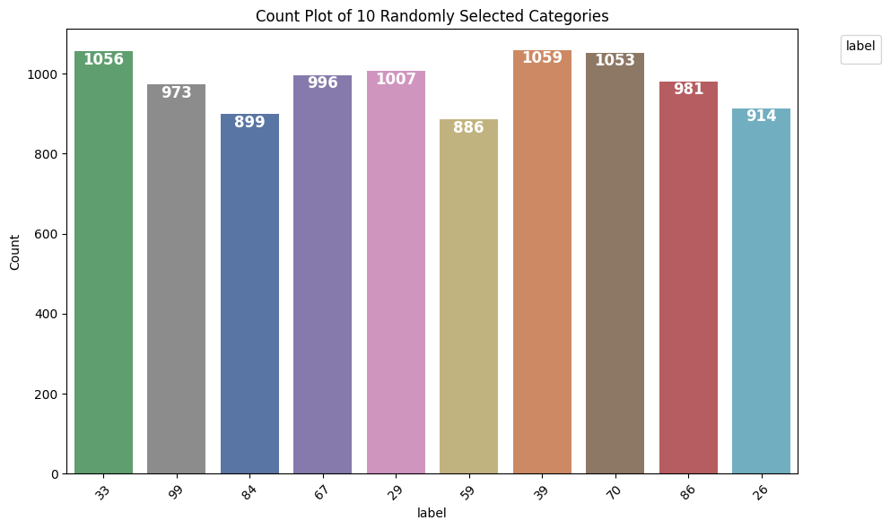
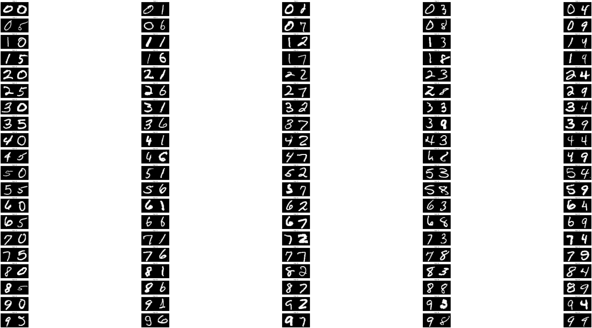
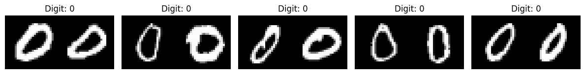
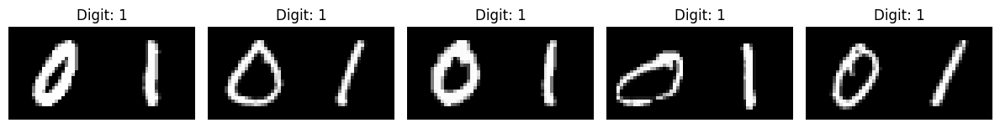
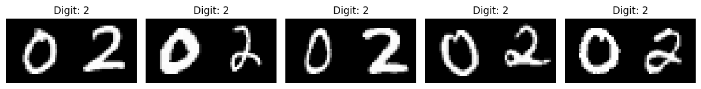
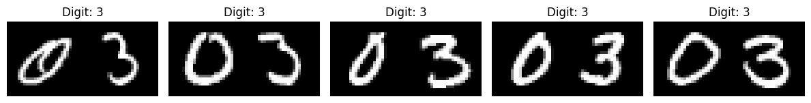
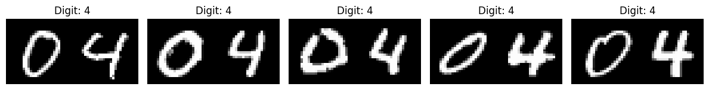
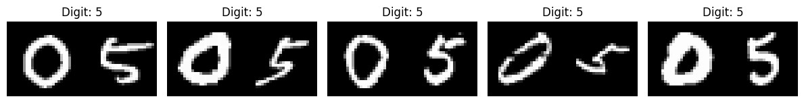

<!-- ──────────────────────────────  B A N N E R  ────────────────────────────── -->

<p align="center">
  
</p>

<h1 align="center">Two-Digit Hand-Written Number Recognition with CNN 🚀</h1>

<p align="center">
  <b>Poulami Nandi, PhD &middot; Data Scientist | Quant Researcher</b><br/>
  <a href="https://www.linkedin.com/in/poulami-nandi-a8a12917b/">LinkedIn</a> | 
  <a href="https://scholar.google.com/citations?user=bOYJeAYAAAAJ">Google Scholar</a> | 
  <a href="https://github.com/Poulami-Nandi">GitHub Portfolio</a>
</p>

---

## 📖 Table of Contents
1. [Project Motivation](#project-motivation)
2. [Dataset](#dataset)
3. [Model Architecture](#model-architecture)
4. [Quick Start](#quick-start)
5. [Re-producing Results](#re-producing-results)
6. [Performance](#performance)
7. [Inside the Notebook](#inside-the-notebook)
8. [Research Extensions](#research-extensions)
9. [Citation](#citation)
10. [License](#license)

---

## Project Motivation
Most MNIST examples focus on **single-digit** recognition.  
In several computer-vision tasks (cheque reading, meter reading, postal codes, etc.) the model must interpret **multi-digit strings** holistically.

This repository shows how to:

* **Synthesise** a two-digit dataset by horizontally concatenating MNIST digits.  
* **Scale** a CNN to classify 100 classes (00-99) instead of the usual 10.  
* Achieve **> 98 % validation accuracy** with a lightweight network.

The work doubles as an accessible demo of **tensor manipulation**, **data-augmentation**, and **Keras functional APIs**—skills equally valuable in my quantum-mechanics research where CNNs are repurposed to detect phase-transition patterns in simulated spin-lattices.

---

## Dataset
| Split | Images | Resolution | Notes |
|-------|--------|------------|-------|
| Train | 99 000 | 28 × 56 px | 2× MNIST digits concatenated |
| Test  | 20 000 | 28 × 56 px | Held-out for leaderboard style score |



---

## Model Architecture
```text
Input 28×56×1
│
├─ Conv2D(32,3×3) + ReLU
├─ Conv2D(32,3×3) + ReLU
├─ MaxPool2D(2×2)
│
├─ Conv2D(64,3×3) + ReLU
├─ Conv2D(64,3×3) + ReLU
├─ MaxPool2D(2×2)
│
├─ Flatten
├─ Dense(256) + ReLU
├─ Dropout(0.5)
└─ Dense(100) + Softmax     → class 00-99
```

*(see [`twoDigRecognizeCNN.ipynb`](twoDigRecognizeCNN.ipynb) for the full, parametrised version)*

---

## Quick Start
```bash
git clone https://github.com/Poulami-Nandi/twoDigRecognizeCNN.git
cd twoDigRecognizeCNN

# 1️⃣  create env & install
conda env create -f environment.yml   # or pip install -r requirements.txt
conda activate two-digit-cnn

# 2️⃣  run end-to-end notebook
jupyter notebook twoDigRecognizeCNN.ipynb
```

A ready-to-submit `submission_2d.csv` (Kaggle format) is generated at the end of the notebook.

---

## Re-producing Results
```bash
python train.py  \
  --epochs 25 \
  --batch-size 128 \
  --model_dir saved_models/ \
  --log_dir   tensorboard_logs/
```

Key hyper-parameters are exposed via CLI flags.

---

## Performance
| Metric                  | Train | Validation |
|-------------------------|-------|------------|
| **Accuracy**            | **99.84 %** | **98.04 %** |
| **Cross-Entropy Loss**  | 0.0051 | 0.0917 |

Training curves:

 

Confusion matrix:



---

## Inside the Notebook
| Section | Highlights | Figure |
|---------|------------|--------|
| **EDA & Visualisation** | pixel-intensity histograms, class balance |  |
| **Data Pipeline** | NumPy stacks → `tf.data.Dataset` → on-the-fly augmentation |  |
| **Training** | `ReduceLROnPlateau`, `ModelCheckpoint`, `TensorBoard` callbacks |  |
| **Error Analysis** | visualise top-k mis-classifications |  |

*(12 additional figures are stored in `assets/` for reference.)*

---

## Research Extensions
* **Quantum-mechanics imaging** – port the same CNN to classify snapshots of **Hubbard-model** simulations (work in progress in my lab notebook).
* **Sequence models** – replace concatenation with an attention-based recogniser for variable-length digit strings.
* **Hardware deployment** – convert the Keras model to **TensorFlow Lite** for on-device digit reading (embedded meters / industrial scanners).

---

## Citation
If you use this codebase, please cite:

```bibtex
@misc{nandi2025twodigcnn,
  author  = {Poulami Nandi},
  title   = {Two consecutive Digit Recognition Using Convolutional Neural Network},
  year    = {2025},
  url     = {https://github.com/Poulami-Nandi/twoDigRecognizeCNN}
}
```

---

## License
Distributed under the MIT License (see [`LICENSE`](LICENSE)).


# Two consecutive Digit Recognition Using Convolutional Neural Network (CNN)

In this repo, we solve the Kaggle-MNIST Digit Recognizer competition using Convolutional Neural Networks (CNNs).
This approach leverages the power of CNNs to classify handwritten digit images from the MNIST dataset.
We'll cover data visualization, preprocessing, model building, training, and evaluation.
- We take the MNIST single digit dataset and convert that to two digit dataset by horizontal concatenation and run CNN model on that

## Data Loading
We first load and inspect the training and test datasets.

## Table of Contents
- [Overview](#overview)
- [Dataset](#dataset)
- [Model Architecture](#model-architecture)
- [Installation](#installation)
- [Training](#training)
- [Results](#results)
- [Contributing](#contributing)
- [License](#license)

## Overview
The project uses a CNN model built with TensorFlow/Keras to classify digits in the MNIST dataset. This is a standard deep learning task that provides a solid foundation for understanding neural network models applied to image classification.

## Dataset
The MNIST dataset consists of 70,000 grayscale images of handwritten digits, where each image is 28x56 pixels in size:
- **Training set**: 99,000 images
- **Test set**: 20,000 images

Each image is labeled from 0 to 99, corresponding to the digit it represents.

## Model Architecture
The model is a Convolutional Neural Network (CNN) with the following structure:
1. **Input Layer**: Accepts 28x56 grayscale images
2. **Convolutional Layers**: Extracts features from the images
3. **Pooling Layers**: Reduces spatial dimensions
4. **Fully Connected Layers**: Maps features to digit classes
5. **Output Layer**: Uses softmax activation for multiclass classification (digits 0-9)

## Installation

1. **Clone the repository**:
   ```bash
   git clone https://github.com/Poulami-Nandi/twoDigRecognizeCNN.git
   cd twoDigRecognizeCNN

## Results
Final Training Accuracy: 0.9984

Final Validation Accuracy: 0.9804

Final Training Loss: 0.0051

Final Validation Loss: 0.0917
